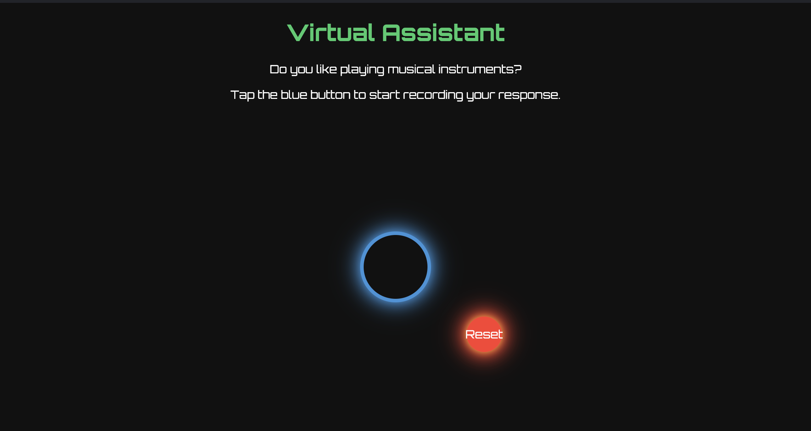

# Question Transcription App

## How to Run the App

1. **Prerequisites**: Ensure you have Docker installed on your local machine.
2. **Start the Application**: Open a terminal and navigate to the project directory. Run the command `docker-compose up` to start the application.
3. **Check Backend Status**: Confirm that the Flask backend is running by visiting [http://localhost:2000/](http://localhost:2000/).
4. **Access the App**: Open your web browser and navigate to [http://localhost:3000/](http://localhost:3000/) to use the app.

## About the App

This application prompts users with questions, to which they can respond with a "yes" or "no". The user's response is sent to the backend, where transcription occurs using OpenAI's Whisper model. Based on the transcription, if the response is determined to be "yes" or "no", it is logged into log.txt file in the backend folder. Otherwise, the user is prompted to answer again. This process repeats three times, after which an invalid response is logged and the interaction is terminated.

## Backend Code

The backend of the application is built using Flask, a lightweight web framework for Python. Here's an overview of the backend code:

- **Transcription Endpoint**: The `/transcribe_audio` endpoint transcribes audio responses using the Whisper model. Depending on the transcription, it returns "yes", "no", or "invalid".
- **Question Retrieval Endpoint**: The `/get_question` endpoint retrieves random questions for users to respond to.
- **Logging**: Responses and their corresponding questions are logged in the `log.txt` file.
- **Static HTML Page**: The root endpoint `/` returns a basic HTML page.

## The UI

The UI of the assistant is pretty simple, the question is displayed to the user as shown in the picture below, it is also read out using react-tts, then the user can press the button to answer the question, based on the correctness of the user's response further instructions are communicated through voice.

## Dependencies

- Flask: Lightweight web framework for Python.
- Whisper: OpenAI's model for transcription.
- Docker: Containerization platform for easy deployment and management.
